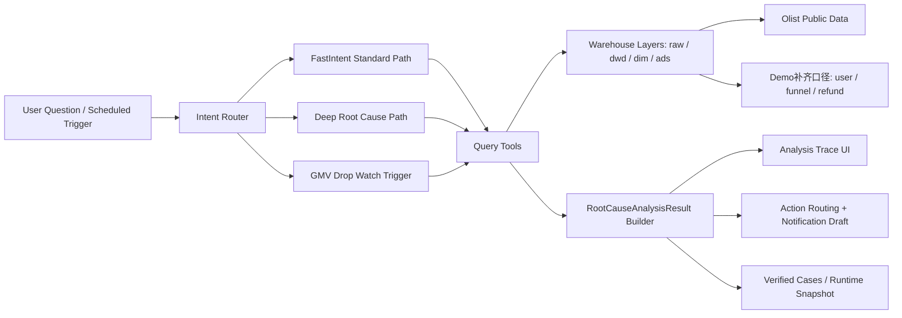
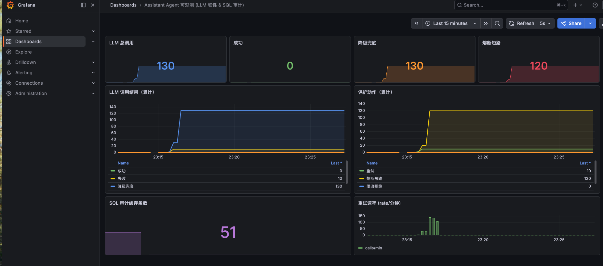

# Assistant Agent

[English](README.md) | [中文](README_zh.md)

[](LICENSE)
[](https://openjdk.org/)
[](https://spring.io/projects/spring-boot)
[](https://spring.io/projects/spring-ai)
[](https://www.graalvm.org/)

## 🎯 About This Fork (Portfolio Project)

> This is a **portfolio fork** built on top of the open-source [Spring AI Alibaba — AssistantAgent](https://github.com/spring-ai-alibaba/AssistantAgent) framework. The base framework (the Code-as-Action engine and the experience / learning / trigger modules) comes from the upstream project. Everything described in this section is what I added in this fork.

**What I built on top of the framework:**

- **Ecommerce operations anomaly agent** — an end-to-end workflow (`anomaly → root-cause analysis → ownership routing → notification draft`) instead of a generic chatbot. Includes the warehouse data layer (`raw / dwd / dim / ads`), Olist public-dataset integration, and a multi-step GMV-drop root-cause graph.
- **12 operations-diagnosis tools**, all computed live from the warehouse (no hard-coded answers): GMV / order / user / category / funnel / refund / region drill-down, plus three tools modelled on real operations workflows:
  - **ReleaseImpactTool** — before/after comparison of order volume, GMV and average order value around a release date, to tell whether a release helped or hurt.
  - **AbTestJudgeTool** — aggregates an A/B experiment's conversion rate / orders / GMV from real behaviour data and declares the winner with the relative lift.
  - **OrderAbandonmentTool** — computes order-abandonment and payment-failure rates from order-status data, to separate "users dropped off" from "the payment step broke".
- **Hardened the experience & learning system to production standard** — implemented the remaining open items (experience search, Cron-expression validation), added a prompt-injection guard and OpenTelemetry span-lifecycle management, and built **127 tests (0 failures)** across the modules I touched.

Scope of my changes in this fork: **~168 files, +31k / −1.1k lines**, covering the ecommerce layer and the productionization work.

## Ecommerce Operations Anomaly Agent

This repository is currently shaped as an **Agent engineering portfolio project** with a product-facing demo. The core idea is simple: instead of building a generic chatbot, the Agent is embedded into an ecommerce operations workflow.

```text
business anomaly -> anomaly_id -> Agent route -> tool evidence -> root cause -> human confirmation -> owner dispatch -> Feishu notification / workflow record
```

The main demo page is:

```text
http://localhost:18080/agent-console/index.html
```

What the demo shows:

- **Anomaly center**: business systems or monitoring rules produce an `anomaly_id`.
- **Agent routing**: `anomaly_id -> metric_id -> analysis_route`, so different anomaly types use different analysis priorities.
- **Tool-based evidence**: the Agent does not only answer text; it calls GMV, order, user, category, funnel, refund, region drill-down, release-impact, A/B-test and order-abandonment tools — all computed live from the warehouse.
- **Human-in-the-loop control**: analysts confirm whether the anomaly is valid before dispatching or sending notifications.
- **Ownership workflow**: platform/category/growth/after-sales roles can receive, handle, record and close anomalies.
- **Delivery channel**: Feishu notification is a delivery side effect, separated from workflow state.

For a short walkthrough, see [DEMO_SCRIPT.md](DEMO_SCRIPT.md).

## Ecommerce Analysis Agent Extension

This fork includes an ecommerce operations analysis Agent built on AssistantAgent. The goal is not to build another BI chatbot, but to connect an operational workflow:

```text
detect anomaly -> break down dimensions -> explain root cause -> route ownership -> draft notification
```

The current showcase focuses on a GMV drop scenario. A scheduled/manual trigger detects a GMV anomaly, runs a multi-step root cause workflow, produces evidence cards, routes the issue to business roles, and generates a Feishu-ready notification draft.

### Why This Project Exists

Traditional "ask data in natural language" products are useful for single metrics, but ecommerce operations often need a chain of actions: compare GMV, split order volume and AOV, drill into region/category, check user scale, inspect funnel/refund signals, and then push the finding to the right owner.

This project uses **Text-to-Code / Code-as-Action** instead of only Text-to-SQL:

- **Standard questions** use FastIntent and curated snapshots for fast answers.
- **Root cause questions** run a deeper tool chain for multi-step analysis.
- **Operational triggers** proactively run the same analysis without waiting for a user question.
- **Verified cases and runtime bad cases** keep the workflow regression-testable.

### Core Demo Flow

Open the operations console:

```bash
http://localhost:18080/agent-console/index.html
```

Click **运行 GMV 异常巡检**. The page calls:

```http
POST /api/ecommerce/triggers/gmv-drop-watch/run-once
```

The trigger uses `demo-report-date=2018-08-29` for a stable showcase anomaly and returns a full analysis result:

- path tag: `trigger -> deep`
- elapsed time
- data source summary
- tool chain summary
- key evidence cards
- cause ranking
- action routing
- notification draft

### Architecture



### Data Source Policy

This project intentionally uses a mixed data line:

- **Olist public data**: region, order, category and product/seller drill-down.
- **Demo-completed logic**: user scale, funnel and refund signals, because public Olist data does not contain complete behavior-stream and after-sales details.

The UI explicitly shows this lineage so the demo does not overclaim production-grade data coverage.

### Local Run For The Ecommerce Demo

```bash
JAVA_HOME=/path/to/java17 \
mvn -Dmaven.repo.local=.m2/repository -pl assistant-agent-start spring-boot:run \
  -Dspring-boot.run.arguments="\
--server.port=18080 \
--app.datasource.olist-raw-import-dir=/absolute/path/to/data/olist-csv \
--app.datasource.bootstrap-olist-analytics=true \
--app.datasource.prefer-olist-analytics=true \
--app.operations.gmv-drop-watch.enabled=true \
--app.operations.gmv-drop-watch.demo-report-date=2018-08-29"
```

Then visit:

```text
http://localhost:18080/agent-console/index.html
```

### Production-Oriented Deployment

The first deployable shape is a single Spring Boot service:

- `assistant-agent-start/src/main/resources/application-prod.yml`
- `deploy/.env.example`
- `deploy/Dockerfile`
- `deploy/docker-compose.yml`
- `deploy/start-prod.sh`
- `deploy/stop-prod.sh`
- `deploy/logs.sh`

Use `bash deploy/start-prod.sh` after preparing `.env` from `deploy/.env.example`.

### Availability & Resilience (LLM call protection)

An Agent's bottleneck and failure modes live in the **LLM provider call**, not in local CPU — so "high concurrency" here means surviving provider timeouts, 5xx/429 and cost spikes, not chasing raw QPS. Every LLM call goes through a hand-rolled, zero-dependency resilience layer (`assistant-agent-core/.../resilience`), composed in this order and for these reasons:

```text
rate limit  →  concurrency cap  →  circuit breaker  →  retry (backoff+jitter)  →  per-call timeout  →  LLM call
(cost/quota)   (protect threads)   (fast-fail bad provider)  (recover transient)   (bound each attempt)
```

- **Circuit breaker** — CLOSED / OPEN / HALF_OPEN state machine with a count-based sliding-window failure rate and half-open probing. When the provider is unhealthy it fast-fails instead of retry-storming, then probes with a little traffic before recovering.
- **Retry with exponential backoff + jitter** — only for transient/retryable errors; jitter avoids synchronized retry storms.
- **Token-bucket rate limiter + bulkhead** — cap request rate (cost/quota) and in-flight concurrency.
- **Graceful degradation** — when a call is shed or ultimately fails, the agent returns a readable fallback response instead of throwing.

This is wired in via `app.llm.resilience.*` (on by default; per-call timeout off by default since real LLM calls are legitimately long).

A reproducible load harness drives concurrent traffic through a fake model (no API cost) and prints real numbers:

```bash
mvn test -pl assistant-agent-core -Dtest=LlmResilienceLoadTest
```

| Scenario | Result |
|----------|--------|
| Healthy (provider all-success) | ~3,900 QPS, p50 3.8ms / p95 5.0ms / p99 8.9ms — thin wrapper overhead |
| Degraded (severe outage, ~80% provider failures) | circuit breaker opens after ~35 calls and **short-circuits the remaining ~2,960 requests** to an instant graceful fallback — only ~1% of traffic keeps hitting the dead provider, instead of a retry-storm; zero leaked exceptions |

Beyond the LLM path, the project also ships warehouse read-caching (TTL + cache-stats) and a 3-level semantic-retrieval fallback for the experience store, so a vector-store outage degrades instead of breaking the agent.

**Observability & SQL transparency** (Java-native, self-hostable — no foreign SaaS):

- **Metrics** — the resilience counters (`llm_resilience_*`) and SQL-audit gauge are exposed at `/actuator/prometheus` (Micrometer). A one-command Prometheus + Grafana stack with a pre-provisioned dashboard lives in [`deploy/observability/`](deploy/observability/README.md) (`docker compose up -d`).
- **Tracing** — the agent lifecycle (code generation, code execution, tool calls, hooks, interceptors) is instrumented with OpenTelemetry spans; point an OTLP exporter at Jaeger/Tempo to view full request traces. (For LLM-specific prompt/token/cost views, the OTel data also ingests into Langfuse — the open-source, self-hostable LangSmith alternative.)
- **SQL transparency** — every warehouse query the agent runs (SQL, bound params, row count, latency) is captured and visible at `GET /api/ecommerce/sql-audit/recent`, so an analyst can verify exactly which query produced a given number — turning Text-to-Code from a black box into an auditable process.
- **Self-test / health probe** — `POST /api/ecommerce/llm-selftest?times=N` drives N probe calls through the same resilient executor: in production it's a canary (a provider outage moves the metrics before users notice); in a demo it lights up the failure/retry/fallback/short-circuit curves.



*Live dashboard during a simulated provider outage (probe run with no valid API key). Reading it: of 130 LLM calls, the first 10 actually reached the provider and failed (each retried once); the circuit breaker then opened and **short-circuited the remaining 120** (fast-fail instead of a retry-storm); all **130 returned a graceful fallback** — zero leaked exceptions. The bottom-left tile shows the SQL-audit trail capturing real warehouse queries. Every number is scraped live from `/actuator/prometheus`.*

## ✨ Technical Features

- 🚀 **Code-as-Action**: Agent generates and executes code to complete tasks, rather than just calling predefined tools
- 🔒 **Secure Sandbox**: AI-generated code runs safely in GraalVM polyglot sandbox with resource isolation
- 📊 **Multi-dimensional Evaluation**: Multi-layer intent recognition through Evaluation Graph, precisely guiding Agent behavior
- 🔄 **Dynamic Prompt Builder**: Dynamically inject runtime context, prefetched experience candidates, and stable guidance into prompts based on scenarios and evaluation results
- 🧠 **Unified Experience System**: Manage COMMON / REACT / TOOL experiences in one model, support conversion to and from the Skills model, and improve experience efficiency and quality through progressive disclosure
- 🗂️ **Management Console**: Provide a dedicated management module for experience search, CRUD, statistics, and SKILL preview / import / export, so reusable experience and skill assets can be maintained in one place
- ⚡ **Fast Response**: For familiar scenarios, skip LLM reasoning process and respond quickly based on experience

## 📖 Introduction

**Assistant Agent** is an enterprise-grade intelligent assistant framework built on [Spring AI Alibaba](https://github.com/alibaba/spring-ai-alibaba), adopting the Code-as-Action paradigm to orchestrate tools and complete tasks by generating and executing code. It's an intelligent assistant solution that **understands, acts, and learns**.

* <a href="https://java2ai.com/agents/assistantagent/quick-start" target="_blank">Documentation</a>
* <a href="https://java2ai.com/docs/overview" target="_blank">Spring AI Alibaba</a>

### What Can Assistant Agent Do?

Assistant Agent is a fully-featured intelligent assistant with the following core capabilities:

- 🔍 **Intelligent Q&A**: Supports unified retrieval architecture across multiple data sources (extensible via SPI for knowledge base, Web, etc.), providing accurate, traceable answers
- 🛠️ **Tool Invocation**: Supports MCP, HTTP API (OpenAPI) and other protocols, can invoke tools directly in the React loop or orchestrate multiple tools in generated code for more complex workflows
- ⏰ **Proactive Service**: Supports scheduled tasks, delayed execution, event callbacks, letting the assistant proactively serve you
- 📬 **Multi-channel Delivery**: Built-in IDE reply, extensible to DingTalk, Feishu, WeCom, Webhook and other channels via SPI
- 🧩 **Experience and Operations Management**: Supports experience management, tenant-aware retrieval, and bidirectional conversion between the experience model and SKILL packages, making it easier to accumulate and reuse business capabilities

### Why Choose Assistant Agent?

| Value | Description |
|-------|-------------|
| **Cost Reduction** | 24/7 intelligent customer service, significantly reducing manual support costs |
| **Quick Integration** | Business platforms can integrate with simple configuration, no extensive development required |
| **Flexible Customization** | Configure knowledge base, integrate enterprise tools, build your exclusive business assistant |
| **Continuous Optimization** | Automatically learns and accumulates experience, the assistant gets smarter with use |

### Use Cases

- **Intelligent Customer Service**: Connect to enterprise knowledge base, intelligently answer user inquiries
- **Operations Assistant**: Connect to monitoring and ticketing systems, automatically handle alerts, query status, execute operations
- **Business Assistant**: Connect to CRM, ERP and other business systems, assist employees in daily work


> 💡 The above are just typical scenario examples. By configuring knowledge base and integrating tools, Assistant Agent can adapt to more business scenarios. Feel free to explore.


### Overall Working Principle

Below is an end-to-end flow example of how Assistant Agent processes a complete request:


### Project Structure

```
AssistantAgent/
├── assistant-agent-common          # Common tools, enums, constants
├── assistant-agent-core            # Core engine: GraalVM executor, tool registry
├── assistant-agent-extensions      # Extension modules:
│   ├── dynamic/               #   - Dynamic tools (MCP, HTTP API)
│   ├── experience/            #   - Unified experience runtime, disclosure, and FastIntent configuration
│   ├── learning/              #   - Learning extraction and storage
│   ├── search/                #   - Unified search capability
│   ├── reply/                 #   - Multi-channel reply
│   ├── trigger/               #   - Trigger mechanism
│   └── evaluation/            #   - Evaluation integration
├── assistant-agent-prompt-builder  # Prompt dynamic assembly
├── assistant-agent-evaluation      # Evaluation engine
├── assistant-agent-management      # Experience management and SKILL conversion APIs
├── assistant-agent-autoconfigure   # Spring Boot auto-configuration
└── assistant-agent-start           # Startup module
```

### Week E Operational Guardrails

If you want to understand how the ecommerce analysis Agent stays controlled when it starts sending scheduled reports and anomaly alerts, see:

- [SECURITY.md](SECURITY.md)
- [ROBUSTNESS.md](ROBUSTNESS.md)
- [DEMO_DAILY_REPORT_CHAIN.md](DEMO_DAILY_REPORT_CHAIN.md)
- [DEMO_ROOT_CAUSE_CHAIN.md](DEMO_ROOT_CAUSE_CHAIN.md)

## 🚀 Quick Start

### Prerequisites

- Java 17+
- Maven 3.8+
- DashScope API Key

### 1. Clone and Build

```bash
git clone https://github.com/AnthonyInUK/ecommerce-operations-agent.git
cd ecommerce-operations-agent
mvn clean install -DskipTests
```

### 2. Configure API Key

```bash
export DASHSCOPE_API_KEY=your-api-key-here
```

### 3. Minimal Configuration

The project has built-in default configuration, just ensure the API Key is correct. For customization, edit `assistant-agent-start/src/main/resources/application.yml`:

```yaml
spring:
  ai:
    dashscope:
      api-key: ${DASHSCOPE_API_KEY}
      chat:
        options:
          model: qwen-max
```

### 4. Start the Application

```bash
cd assistant-agent-start
mvn spring-boot:run
```

All extension modules are enabled by default with sensible configurations; no additional configuration is required for a quick start.

### 5. Configure Knowledge Base (Connect to Business Knowledge)

> 💡 The framework provides a Mock knowledge base implementation by default for demonstration and testing. **Production environments need to connect to real knowledge sources** (such as vector databases, Elasticsearch, enterprise knowledge base APIs, etc.) so that the Agent can retrieve and answer business-related questions.

#### Option 1: Quick Experience (Using Built-in Mock Implementation)

The default configuration has knowledge base search enabled, you can experience it directly:

```yaml
spring:
  ai:
    alibaba:
      codeact:
        extension:
          search:
            enabled: true
            knowledge-search-enabled: true  # Enabled by default
```

#### Option 2: Connect to Real Knowledge Base (Recommended)

Implement the `SearchProvider` SPI interface to connect to your business knowledge sources:

```java
package com.example.knowledge;

import com.alibaba.assistant.agent.extension.search.spi.SearchProvider;
import com.alibaba.assistant.agent.extension.search.model.*;
import org.springframework.stereotype.Component;
import java.util.*;

@Component  // Add this annotation, Provider will be auto-registered
public class MyKnowledgeSearchProvider implements SearchProvider {

    @Override
    public boolean supports(SearchSourceType type) {
        return SearchSourceType.KNOWLEDGE == type;
    }

    @Override
    public List<SearchResultItem> search(SearchRequest request) {
        List<SearchResultItem> results = new ArrayList<>();
        
        // 1. Query from your knowledge source (vector database, ES, API, etc.)
        // Example: List<Doc> docs = vectorStore.similaritySearch(request.getQuery());
        
        // 2. Convert to SearchResultItem
        // for (Doc doc : docs) {
        //     SearchResultItem item = new SearchResultItem();
        //     item.setId(doc.getId());
        //     item.setSourceType(SearchSourceType.KNOWLEDGE);
        //     item.setTitle(doc.getTitle());
        //     item.setSnippet(doc.getSummary());
        //     item.setContent(doc.getContent());
        //     item.setScore(doc.getScore());
        //     results.add(item);
        // }
        
        return results;
    }

    @Override
    public String getName() {
        return "MyKnowledgeSearchProvider";
    }
}
```

#### Common Knowledge Source Integration Examples

| Knowledge Source Type | Integration Method |
|----------------------|-------------------|
| **Vector Database** (Alibaba Cloud AnalyticDB, Milvus, Pinecone) | Call vector similarity search API in `search()` method |
| **Elasticsearch** | Use ES client for full-text or vector search |
| **Enterprise Knowledge Base API** | Call internal knowledge base REST API |
| **Local Documents** | Read and index local Markdown/PDF files |

> 📖 For more details, refer to: [Knowledge Search Module Documentation](assistant-agent-extensions/src/main/java/com/alibaba/assistant/agent/extension/search/README.md)

## 🧩 Core Modules

For detailed documentation on each module, please visit our [Documentation Site](https://java2ai.com/agents/assistantagent/quick-start).

### Core Modules

| Module | Description | Documentation |
|--------|-------------|---------------|
| **Evaluation** | Multi-dimensional intent recognition through Evaluation Graph with LLM and rule-based engines | [Quick Start](https://java2ai.com/agents/assistantagent/features/evaluation/quickstart) ｜ [Advanced](https://java2ai.com/agents/assistantagent/features/evaluation/advanced) |
| **Prompt Builder** | Dynamic prompt assembly based on evaluation results and runtime context | [Quick Start](https://java2ai.com/agents/assistantagent/features/prompt-builder/quickstart) ｜ [Advanced](https://java2ai.com/agents/assistantagent/features/prompt-builder/advanced) |

### Tool Extensions

| Module | Description | Documentation |
|--------|-------------|---------------|
| **MCP Tools** | Integration with Model Context Protocol servers for tool ecosystem reuse | [Quick Start](https://java2ai.com/agents/assistantagent/features/mcp/quickstart) ｜ [Advanced](https://java2ai.com/agents/assistantagent/features/mcp/advanced) |
| **Dynamic HTTP Tools** | REST API integration through OpenAPI specification | [Quick Start](https://java2ai.com/agents/assistantagent/features/dynamic-http/quickstart) ｜ [Advanced](https://java2ai.com/agents/assistantagent/features/dynamic-http/advanced) |
| **Custom CodeAct Tools** | Build custom tools using the CodeactTool interface | [Quick Start](https://java2ai.com/agents/assistantagent/features/custom-codeact-tool/quickstart) ｜ [Advanced](https://java2ai.com/agents/assistantagent/features/custom-codeact-tool/advanced) |

### Intelligence Capabilities

| Module | Description | Documentation |
|--------|-------------|---------------|
| **Experience** | Unified COMMON / REACT / TOOL experience model with FastIntent support, conversion to and from Skills, progressive disclosure, and runtime retrieval via `search_exp` / `read_exp` | [Quick Start](https://java2ai.com/agents/assistantagent/features/experience/quickstart) ｜ [Advanced](https://java2ai.com/agents/assistantagent/features/experience/advanced) |
| **Learning** | Automatically extract valuable COMMON / REACT / TOOL experiences from Agent execution history | [Quick Start](https://java2ai.com/agents/assistantagent/features/learning/quickstart) ｜ [Advanced](https://java2ai.com/agents/assistantagent/features/learning/advanced) |
| **Search** | Multi-source unified search engine for knowledge-based Q&A | [Quick Start](https://java2ai.com/agents/assistantagent/features/search/quickstart) ｜ [Advanced](https://java2ai.com/agents/assistantagent/features/search/advanced) |

### Interaction Capabilities

| Module | Description | Documentation |
|--------|-------------|---------------|
| **Reply Channel** | Multi-channel message reply with routing support | [Quick Start](https://java2ai.com/agents/assistantagent/features/reply/quickstart) ｜ [Advanced](https://java2ai.com/agents/assistantagent/features/reply/advanced) |
| **Trigger** | Scheduled tasks, delayed execution, and event callback triggers | [Quick Start](https://java2ai.com/agents/assistantagent/features/trigger/quickstart) ｜ [Advanced](https://java2ai.com/agents/assistantagent/features/trigger/advanced) |

### Management Capabilities

| Capability | Description | Entry |
|--------|-------------|-------|
| **Experience Management API** | Tenant-aware listing, search, stats, and CRUD for runtime experiences | [ExperienceManagementController](assistant-agent-management/src/main/java/com/alibaba/assistant/agent/management/controller/ExperienceManagementController.java) |
| **SKILL Conversion API** | Convert to and from SKILL content, enabling bidirectional conversion between the Skills model and the unified experience model | [SkillExchangeController](assistant-agent-management/src/main/java/com/alibaba/assistant/agent/management/controller/SkillExchangeController.java) |

### Additional Resources

| Resource | Link |
|----------|------|
| Quick Start Guide | [AssistantAgent Quick Start](https://java2ai.com/agents/assistantagent/quick-start) |
| Secondary Development Guide | [Development Guide](https://java2ai.com/agents/assistantagent/secondary-development) |

---

## 📚 Reference Documentation

- [Full Configuration Reference](assistant-agent-start/src/main/resources/application-reference.yml)
- [Spring AI Alibaba Documentation](https://github.com/alibaba/spring-ai-alibaba)

## 📄 License

This project is licensed under the Apache License 2.0 - see the [LICENSE](LICENSE) file for details.

## 🙏 Acknowledgments

- [Spring AI](https://github.com/spring-projects/spring-ai)
- [Spring AI Alibaba](https://github.com/alibaba/spring-ai-alibaba)
- [GraalVM](https://www.graalvm.org/)
